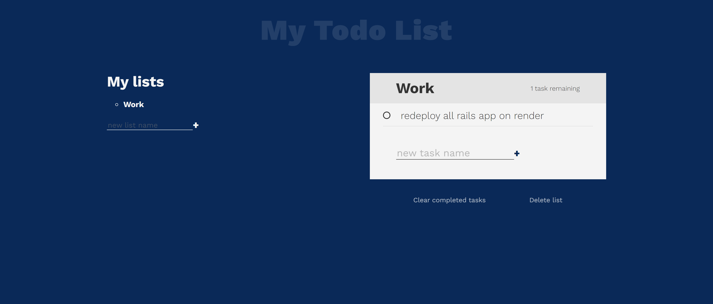

# Modern todo list application

> This project entails building a user-friendly and responsive todo list application in which a user can add new tasks based on different lists, check completed tasks, delete tasks, and remove completed tasks. This project saves users task in local Storage so that user can see all their tasks when they close the app and reopen it. This project was built with JavaScript.

## Built With
- JavaScript

## Live Demo
Visit the live demo [here](https://julie-ify.github.io/Modern-todo-list)

## Getting Started

### Setup

#### To get a local copy up and running follow these simple example steps.

- Click the green `Code` button on the repo
- In your local PC, open your terminal in the folder you would like to clone the project.
- Clone the repo with the command: `git clone (copied link)`; like so: `git clone git@github.com:julie-ify/Modern-todo-list.git`
- On the terminal, navigate into the directory like so: `cd Modern-todo-list`
- Checkout to branch name like so: `git checkout [branch name]`
- Open the index.html and open the application using live server

## Author

👤 **Juliana Ifionu 💖**

- [GitHub](https://github.com/julie-ify)
- [LinkedIn](https://www.linkedin.com/in/e-ifionu/)

## 🤝 Contributing

Contributions, issues, and feature requests are welcome!

Feel free to check the [issues page](https://github.com/julie-ify/Modern-todo-list/issues).

## Show your support

Give a ⭐️ if you like this project!

## Acknowledgments

- Hat tip to `Web Dev Simplified` and `Kevin Powell`
- Inspiration
- etc